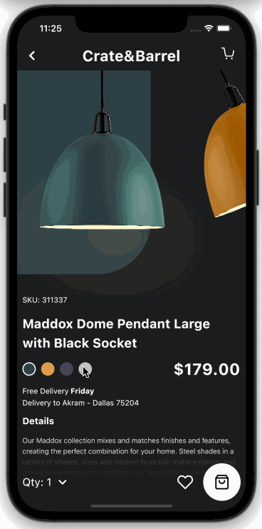

# Crate & Barrel - Dark Mobile App Concept Animated

An animated flutter UI developed by nonybrighto and designed by [Akram Khalid.](https://dribbble.com/shots/8500950-Crate-Barrel-Dark-Mobile-App-Concept-Animated)

## Overview

## [Watch it on YouTube](https://youtu.be/FYP3ih2eATc)

## Animation

## Screenshots

Screenshots from the developed flutter application

| Screenshot 1                                  | Screenshot 2                                  | Screenshot 3                                  |
| --------------------------------------------- | --------------------------------------------- | --------------------------------------------- |
|  |  |  |

## Mentions

The UI is designed by Akram Khalid. located [here](https://dribbble.com/shots/8500950-Crate-Barrel-Dark-Mobile-App-Concept-Animated)

To learn how to make complex flutter animations, watch [Implementing complex UI with Flutter - Marcin Szałek | Flutter Europe](https://www.youtube.com/watch?v=FCyoHclCqc8&t=672s)
